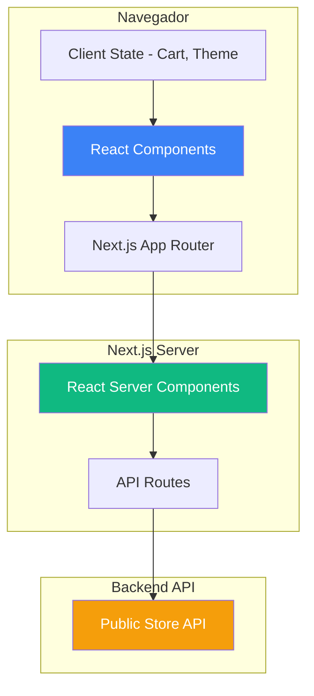
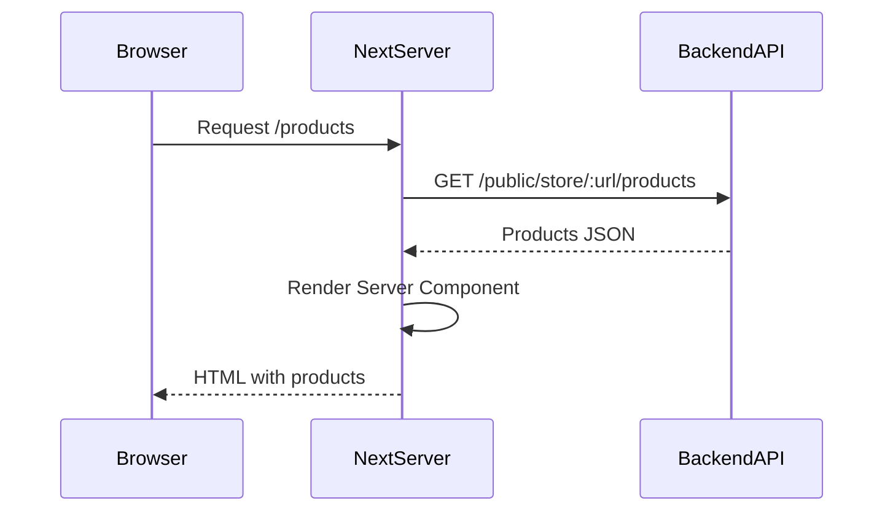
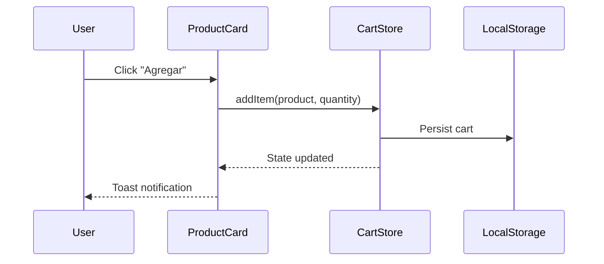
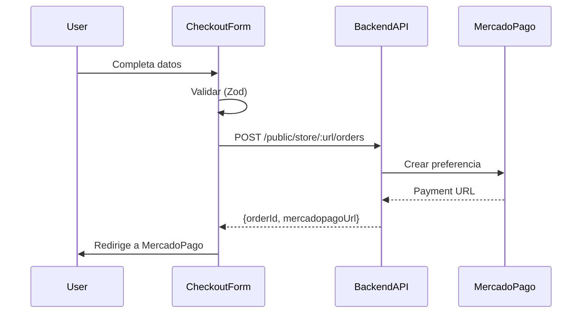

# Arquitectura - E-commerce Template

## Diagrama de Arquitectura



---

## Next.js 15 (App Router)

### File-based Routing

```
/app
├── layout.tsx          # Root layout
├── page.tsx            # Home (/)
├── /products
│   ├── page.tsx       # /products
│   └── /[id]
│       └── page.tsx   # /products/[id]
├── /cart
│   └── page.tsx       # /cart
└── /checkout
    ├── page.tsx       # /checkout
    └── /success
        └── page.tsx   # /checkout/success
```

### Server vs Client Components

**Server** (por defecto):
```tsx
export default async function ProductsPage() {
  const products = await fetch(`${API_URL}/products`);
  return <ProductGrid products={products} />;
}
```

**Client** (cuando necesario):
```tsx
'use client';

import { useState } from 'react';

export function AddToCartButton({ product }) {
  const [loading, setLoading] = useState(false);
  // Interactividad
}
```

**Cuándo usar Client**:
- Hooks (useState, useEffect)
- Event handlers (onClick)
- Browser APIs (localStorage)

---

## Componentes Principales

### 1. Root Layout

```tsx
import { ThemeProvider } from '@/components/theme-provider';

export default function RootLayout({ children }) {
  return (
    <html lang="es" suppressHydrationWarning>
      <body>
        <ThemeProvider attribute="class" defaultTheme="system">
          <Header />
          <main>{children}</main>
          <Footer />
        </ThemeProvider>
      </body>
    </html>
  );
}
```

### 2. Theme Provider

```tsx
'use client';
import { ThemeProvider as NextThemesProvider } from 'next-themes';

export function ThemeProvider({ children, ...props }) {
  return <NextThemesProvider {...props}>{children}</NextThemesProvider>;
}
```

### 3. Cart Hook (Zustand)

```tsx
import { create } from 'zustand';
import { persist } from 'zustand/middleware';

export const useCart = create()(
  persist(
    (set, get) => ({
      items: [],
      addItem: (product, quantity) => set(/* ... */),
      removeItem: (productId) => set(/* ... */),
      clearCart: () => set({ items: [] }),
      get total() {
        return get().items.reduce(
          (sum, item) => sum + item.product.price * item.quantity,
          0
        );
      },
    }),
    { name: 'cart-storage' }
  )
);
```

---

## Flujos de Datos

### Carga de Productos



### Agregar al Carrito



### Checkout



---

## Patrones de Diseño

### Server/Client Pattern

```tsx
// Server Component
export default async function ProductsPage() {
  const products = await fetchProducts();
  return <ProductGrid products={products} />;
}

// Client Component
'use client';
export function ProductGrid({ products }) {
  const [filter, setFilter] = useState('');
  const filtered = products.filter(p => p.name.includes(filter));
  return <div>{/* render */}</div>;
}
```

### Composition Pattern

```tsx
<Dialog>
  <DialogTrigger asChild>
    <Button>Abrir</Button>
  </DialogTrigger>
  <DialogContent>
    <DialogHeader>
      <DialogTitle>Título</DialogTitle>
    </DialogHeader>
    <DialogFooter>
      <Button>Cerrar</Button>
    </DialogFooter>
  </DialogContent>
</Dialog>
```

### Custom Hooks

```tsx
export function useProducts(storeUrl) {
  const [products, setProducts] = useState([]);
  const [loading, setLoading] = useState(true);

  useEffect(() => {
    async function load() {
      const data = await fetchProducts(storeUrl);
      setProducts(data);
      setLoading(false);
    }
    load();
  }, [storeUrl]);

  return { products, loading };
}
```

---

## State Management

- **Local**: `useState` para estado de componente
- **Global**: Zustand con persist para carrito
- **Server**: Fetch directo en Server Components

---

## Rendering Strategies

### SSG (Static)
```tsx
export default async function AboutPage() {
  return <div>Sobre nosotros</div>;
}
```

### SSR (Dynamic)
```tsx
export const dynamic = 'force-dynamic';

export default async function ProductsPage() {
  const products = await fetchProducts();
  return <ProductGrid products={products} />;
}
```

### ISR (Incremental)
```tsx
export const revalidate = 60; // 60 segundos

export default async function ProductsPage() {
  const products = await fetchProducts();
  return <ProductGrid products={products} />;
}
```

---

## Performance

### Image Optimization
```tsx
import Image from 'next/image';

<Image
  src={product.image}
  alt={product.name}
  width={400}
  height={400}
  loading="lazy"
/>
```

### Code Splitting
```tsx
import dynamic from 'next/dynamic';

const HeavyChart = dynamic(() => import('./HeavyChart'), {
  loading: () => <Spinner />,
  ssr: false,
});
```

### Suspense
```tsx
import { Suspense } from 'react';

<Suspense fallback={<ProductsSkeleton />}>
  <ProductList />
</Suspense>
```

---

## SEO

### Metadata API
```tsx
export async function generateMetadata({ params }): Promise<Metadata> {
  const product = await fetchProduct(params.id);

  return {
    title: `${product.name} - Mi Tienda`,
    description: product.description,
    openGraph: {
      images: [product.image],
    },
  };
}
```

### Sitemap
```tsx
// app/sitemap.ts
export default async function sitemap() {
  const products = await fetchProducts();

  return [
    { url: 'https://mitienda.com', lastModified: new Date() },
    ...products.map(product => ({
      url: `https://mitienda.com/products/${product._id}`,
      lastModified: new Date(product.updatedAt),
    })),
  ];
}
```

---

## Form Validation (Zod)

### Schema
```tsx
import { z } from 'zod';

export const checkoutSchema = z.object({
  customer: z.object({
    name: z.string().min(3),
    email: z.string().email(),
    phone: z.string().regex(/^\+?[0-9]{10,}$/),
  }),
  shipping: z.object({
    street: z.string().min(5),
    city: z.string().min(2),
  }),
  paymentMethod: z.enum(['cash', 'transfer', 'mercadopago']),
});

export type CheckoutData = z.infer<typeof checkoutSchema>;
```

### Form
```tsx
import { useForm } from 'react-hook-form';
import { zodResolver } from '@hookform/resolvers/zod';

export function CheckoutForm() {
  const form = useForm<CheckoutData>({
    resolver: zodResolver(checkoutSchema),
  });

  async function onSubmit(data: CheckoutData) {
    await createOrder(data);
    router.push('/checkout/success');
  }

  return <form onSubmit={form.handleSubmit(onSubmit)}>...</form>;
}
```

---

## Accessibility

Radix UI incluye automáticamente:
- ARIA attributes
- Keyboard navigation
- Focus management
- Screen reader support

```tsx
<Dialog>  {/* aria-modal="true" automático */}
  <DialogContent>  {/* Trap focus automático */}
    <DialogTitle>Título accesible</DialogTitle>
  </DialogContent>
</Dialog>
```

---

## Deployment (Vercel)

```bash
vercel --prod

# O conectar GitHub repo
# Auto-deploy en cada push
```

**Environment Variables**:
```
NEXT_PUBLIC_API_URL = https://api.mitienda.com/api
NEXT_PUBLIC_STORE_URL = mi-tienda-online
```

---

## Mejoras Futuras

1. React Query (server state)
2. Optimistic updates (carrito)
3. PWA (service workers)
4. WebSockets (notificaciones)
5. Prefetching (rutas)
6. Reviews system
7. Wishlist
8. User accounts

---

**Última actualización**: 2025-10-15
